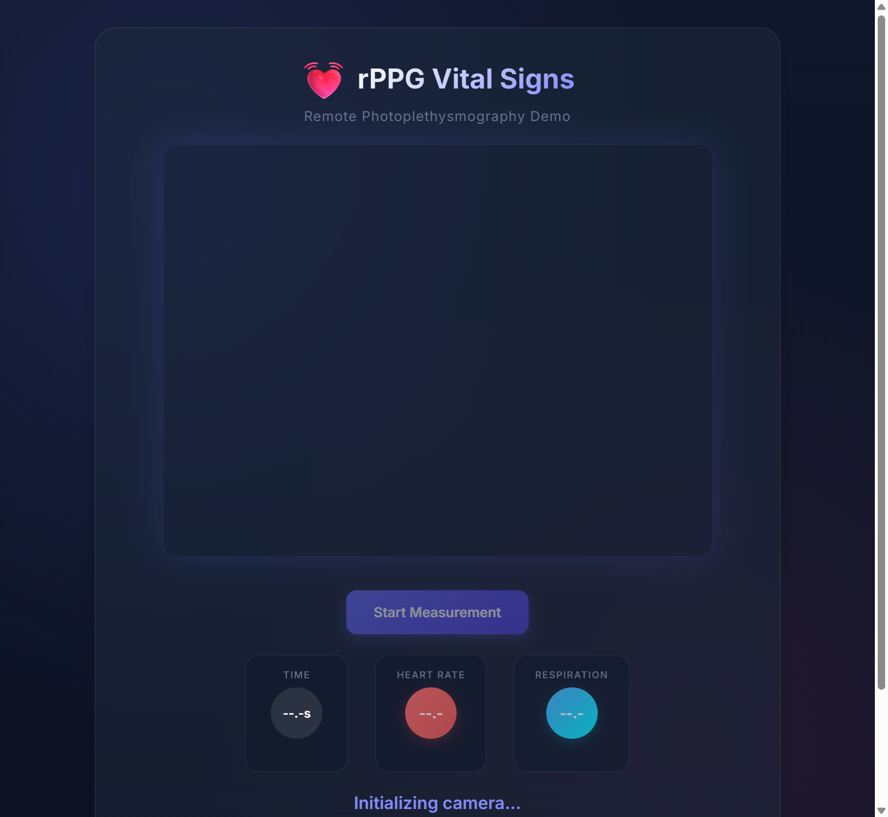

# rPPG Vital Signs

> Remote Photoplethysmography (rPPG) Demo - Contactless Heart Rate and Respiration Monitoring

A browser-based application that estimates heart rate (HR) and respiration rate (RR) from webcam video using remote photoplethysmography (rPPG) techniques. All processing occurs locally in your browser - no data is sent to any server.



## Table of Contents

- [Overview](#overview)
- [Features](#features)
- [How It Works](#how-it-works)
  - [Photoplethysmography Basics](#photoplethysmography-basics)
  - [Signal Extraction](#signal-extraction)
  - [Frequency Analysis](#frequency-analysis)
  - [Algorithm Details](#algorithm-details)
- [Installation](#installation)
- [Usage](#usage)
- [Technical Specifications](#technical-specifications)
- [Project Structure](#project-structure)
- [Limitations](#limitations)
- [Disclaimer](#disclaimer)
- [Credits](#credits)
- [License](#license)

## Overview

Remote Photoplethysmography (rPPG) is a technique that enables contactless measurement of blood volume changes in the microvascular bed of tissue. When blood is pumped through the body, it causes subtle color variations in the skin that are invisible to the naked eye but can be detected by a camera.

This application captures video from your webcam, extracts the green channel signal from a region of interest (ROI) on your face, and uses Fast Fourier Transform (FFT) analysis to identify the dominant frequencies corresponding to:

- **Heart Rate**: 0.8 - 3.5 Hz (48 - 210 BPM)
- **Respiration Rate**: 0.15 - 0.4 Hz (9 - 24 breaths per minute)

## Features

- **Real-time Processing**: Continuous analysis at 30 frames per second
- **Dual Vital Signs**: Simultaneous heart rate and respiration rate estimation
- **Privacy-First**: All processing occurs locally in your browser
- **No Installation Required**: Works directly in modern web browsers
- **Visual Feedback**: Live video with face alignment overlay
- **Statistical Analysis**: Running averages and standard deviations
- **Beautiful UI**: Modern dark theme with glassmorphism design
- **Responsive Design**: Works on desktop and tablet devices

## How It Works

### Photoplethysmography Basics

Photoplethysmography (PPG) measures blood volume changes by detecting light absorption variations. Traditional PPG uses contact sensors (like pulse oximeters), but rPPG achieves this remotely using ambient light and a camera.

The principle relies on the fact that:
1. Hemoglobin in blood absorbs light differently than surrounding tissue
2. As the heart pumps blood, the blood volume in capillaries changes rhythmically
3. These changes cause subtle variations in skin color (particularly in the green channel)
4. A camera can detect these micro-variations over time

### Signal Extraction

1. **Region of Interest (ROI)**: An oval region is defined on the face (forehead/cheek area)
2. **Gaussian Weighting**: Pixels closer to the center are weighted more heavily to reduce edge noise
3. **Green Channel**: The green color channel is extracted (most sensitive to blood volume changes)
4. **Temporal Signal**: Mean green intensity is computed for each frame, creating a time-series signal

```
ROI: { x: 200, y: 100, width: 240, height: 280 }
Weight = 0.5 + 0.5 * exp(-4 * r^2)  where r is normalized distance from center
```

### Frequency Analysis

The time-series signal is analyzed using the Fast Fourier Transform (FFT):

1. **Buffering**: 512 samples (~17 seconds at 30 FPS) are collected
2. **Detrending**: Mean is subtracted to remove DC component
3. **FFT**: Cooley-Tukey algorithm converts time domain to frequency domain
4. **Peak Detection**: Gaussian-weighted peak detection in relevant frequency bands

### Algorithm Details

#### Constants
| Parameter | Value | Description |
|-----------|-------|-------------|
| WIDTH | 640 | Video width in pixels |
| HEIGHT | 480 | Video height in pixels |
| FPS | 30 | Frames per second |
| FFT_SIZE | 512 | FFT window size |
| BUFFER_SIZE | 600 | Signal buffer size (~20 seconds) |
| DURATION | 60 | Measurement duration in seconds |

#### Heart Rate Detection
- Frequency band: 0.8 - 3.5 Hz
- Corresponds to: 48 - 210 BPM
- Gaussian weighting centered on band midpoint

#### Respiration Rate Detection
- Frequency band: 0.15 - 0.4 Hz
- Corresponds to: 9 - 24 breaths per minute
- Detected from amplitude modulation of PPG signal

#### FFT Implementation
The application uses an in-place Cooley-Tukey FFT algorithm with bit-reversal permutation:

```javascript
// Bit-reversal permutation
for (let i = 0; i < n; i++) {
  const j = parseInt(i.toString(2).padStart(bits, '0').split('').reverse().join(''), 2);
  if (j > i) [arr[i], arr[j]] = [arr[j], arr[i]];
}

// Butterfly operations
for (let len = 2; len <= N; len *= 2) {
  const angle = -2 * Math.PI / len;
  // ... complex multiplication and addition
}
```

## Installation

### Option 1: Direct Use (No Installation)
Simply open `public/index.html` in a modern web browser.

### Option 2: Development Server

```bash
# Clone the repository
git clone https://github.com/anthropics/rppg-vital-signs.git
cd rppg-vital-signs

# Install dependencies
npm install

# Start development server
npm run dev

# Open http://localhost:5173/index.html
```

### Option 3: Static Hosting
Upload the `public/` folder to any static hosting service (GitHub Pages, Netlify, Vercel, etc.)

## Usage

1. **Allow Camera Access**: Grant permission when prompted
2. **Position Your Face**: Align your face within the green oval overlay
3. **Stay Still**: Minimize movement for best results
4. **Good Lighting**: Ensure consistent, adequate lighting on your face
5. **Click Start**: Press "Start Measurement" to begin
6. **Wait**: Results improve as more data is collected (~17+ seconds)

### Tips for Best Results
- Use natural or consistent artificial lighting
- Avoid backlighting (light source behind you)
- Keep your face steady and centered
- Ensure the camera can see your forehead and cheeks
- Avoid wearing glasses that reflect light
- Don't move or talk during measurement

## Technical Specifications

### Browser Requirements
- Modern browser with WebRTC support (getUserMedia API)
- JavaScript enabled
- Camera permissions granted

### Supported Browsers
- Chrome 60+
- Firefox 55+
- Safari 11+
- Edge 79+

### Performance
- CPU: ~5-10% utilization on modern processors
- Memory: ~50MB
- No GPU acceleration required

## Project Structure

```
rppg-vital-signs/
├── public/
│   ├── index.html      # Beautiful UI version (main app)
│   └── baseline.html   # Original baseline version
├── docs/
│   ├── screenshot.png  # Demo screenshot
│   ├── ALGORITHM.md    # Detailed algorithm documentation
│   └── TECHNICAL.md    # Technical implementation details
├── README.md           # This file
├── LICENSE             # MIT License
└── package.json        # Node.js project file
```

## Limitations

### Technical Limitations
- **Motion Sensitivity**: Movement causes artifacts in the signal
- **Lighting Dependency**: Poor or changing lighting degrades accuracy
- **Skin Tone Variations**: Algorithm may perform differently across skin tones
- **Camera Quality**: Low-quality cameras reduce signal-to-noise ratio
- **Compression Artifacts**: Video compression can mask subtle color changes

### Accuracy Considerations
- Results are estimates, not clinical measurements
- Individual variation in physiology affects accuracy
- Environmental factors significantly impact results
- No peer-reviewed validation of this specific implementation

### Known Issues
- May not work well with very dark or very bright lighting
- Glasses and facial hair can interfere with ROI
- Rapid movements will corrupt the signal
- Some webcams have automatic exposure that causes artifacts

## Disclaimer

**This is a technology demonstration only, not a medical device.**

- Measurements are uncalibrated and unvalidated
- Results should NOT be used for medical diagnosis or treatment
- Do NOT rely on this for any health decisions
- Consult healthcare professionals for medical concerns
- This software is provided "as is" without warranty

The developers assume no liability for any use of this software or its outputs.

## Credits

### Original Algorithm
Based on the rPPG demo by Viktor T. Toth:
- Website: [vttoth.com/RPPG](https://vttoth.com/RPPG/)
- Algorithm implementation used verbatim

### References

1. Verkruysse, W., Svaasand, L. O., & Nelson, J. S. (2008). Remote plethysmographic imaging using ambient light. *Optics Express*, 16(26), 21434-21445.

2. Poh, M. Z., McDuff, D. J., & Picard, R. W. (2010). Non-contact, automated cardiac pulse measurements using video imaging and blind source separation. *Optics Express*, 18(10), 10762-10774.

3. de Haan, G., & Jeanne, V. (2013). Robust pulse rate from chrominance-based rPPG. *IEEE Transactions on Biomedical Engineering*, 60(10), 2878-2886.

### Technologies Used
- HTML5 Canvas API
- WebRTC getUserMedia API
- Fast Fourier Transform (Cooley-Tukey algorithm)
- Google Fonts (Inter)

## License

MIT License

Copyright (c) 2024

Permission is hereby granted, free of charge, to any person obtaining a copy
of this software and associated documentation files (the "Software"), to deal
in the Software without restriction, including without limitation the rights
to use, copy, modify, merge, publish, distribute, sublicense, and/or sell
copies of the Software, and to permit persons to whom the Software is
furnished to do so, subject to the following conditions:

The above copyright notice and this permission notice shall be included in all
copies or substantial portions of the Software.

THE SOFTWARE IS PROVIDED "AS IS", WITHOUT WARRANTY OF ANY KIND, EXPRESS OR
IMPLIED, INCLUDING BUT NOT LIMITED TO THE WARRANTIES OF MERCHANTABILITY,
FITNESS FOR A PARTICULAR PURPOSE AND NONINFRINGEMENT. IN NO EVENT SHALL THE
AUTHORS OR COPYRIGHT HOLDERS BE LIABLE FOR ANY CLAIM, DAMAGES OR OTHER
LIABILITY, WHETHER IN AN ACTION OF CONTRACT, TORT OR OTHERWISE, ARISING FROM,
OUT OF OR IN CONNECTION WITH THE SOFTWARE OR THE USE OR OTHER DEALINGS IN THE
SOFTWARE.

---

Made with care for educational and demonstration purposes.
